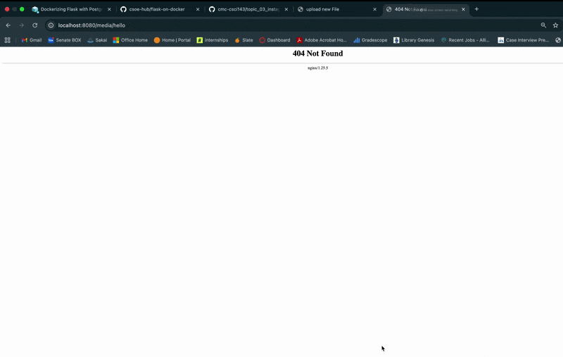

# Flask on Docker (Flask + Postgres + Gunicorn + Nginx)

This repository contains a simple web application built with Flask that runs inside Docker containers. The app allows users to upload an image through a webpage and then view the uploaded image. The project uses PostgreSQL for the database, Gunicorn to run the Flask app in production, and Nginx as a reverse proxy to handle requests and serve static files. Docker Compose is used to manage all of the services together, showing how multiple containers can work together to run a web application.

## Demo

## Tech Stack

- Flask (Python)
- PostgreSQL
- Gunicorn (production WSGI server)
- Nginx (reverse proxy + static/media file serving)
- Docker + Docker Compose

## Build Instructions and Run 

From the repo root:

1. Start the development environment

From the root of the repository, run:

docker compose up -d --build

This command builds the Docker images and starts the containers.

2. Start the production environment

To run the production configuration with Gunicorn and Nginx:

docker compose -f docker-compose.prod.yml up -d --build

Create the database:

docker compose -f docker-compose.prod.yml exec web python manage.py create_db
3. Access the application

Once the containers are running, the web application can be accessed through the browser.

Example:

http://localhost:<port>
4. Upload and view images

You can upload an image at:

/upload

After uploading, the image can be viewed at:

/media/<filename>
5. Stop the containers

To stop the services:

docker compose down
